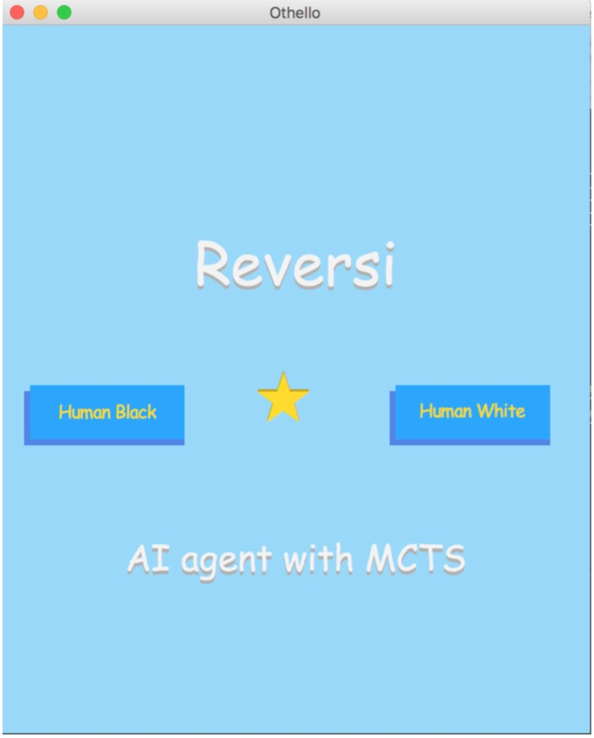
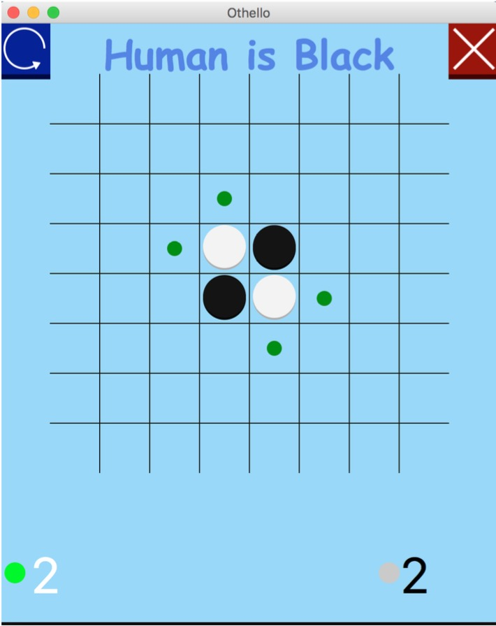

# Othello/Reversi AI 

## Dependency
  * Python3.6
  * C++ 11
  * Pybind11
  * tkinter
  
## Run on Mac osx
----------
  * Compile *pybind11* 
  (Refer to http://pybind11.readthedocs.io/en/stable/)
  On Mac OSX,user can compile pybind11 by following command after download the src file:
  ```
  cd src
  mkdir build
  cd build
  cmake ..
  make check -j 4
  ```

  * Run the program
 ```
  cd src
  python3 setup.py
  python3 game.py
  ```
## UI instruction
  * Main window shows as below:
  
  * Playing mode shows as below:
    

Collaborate with @CandyZhang


